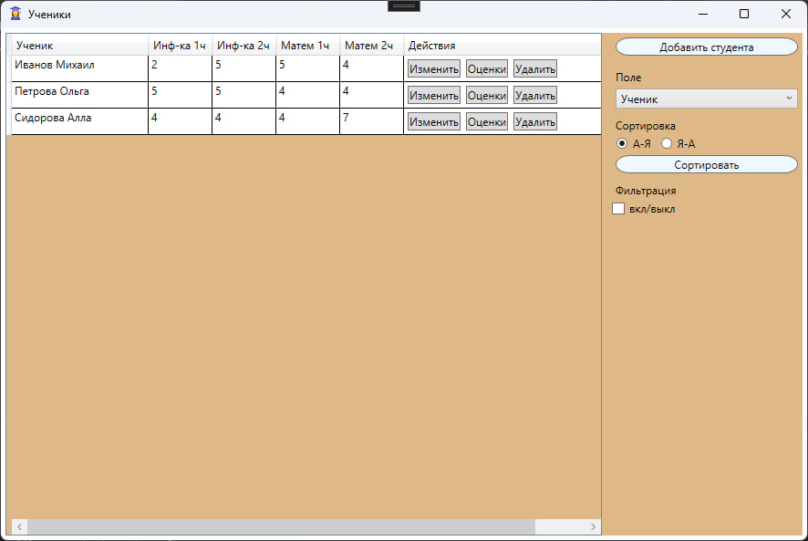
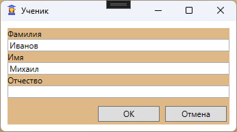
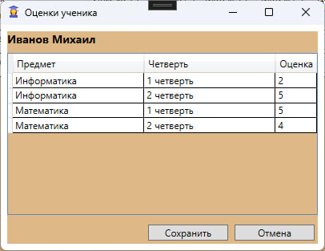
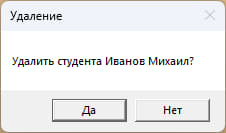
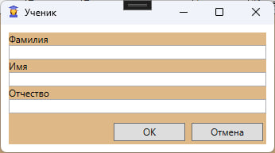
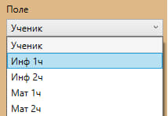
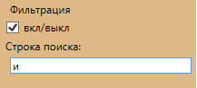

# APP_STUDENTS

**APP_STUDENTS** — приложение для управления учениками и их оценками.

Данный проект демонстрирует навыки работы с WPF, Entity Framework и построением CRUD-интерфейсов. Приложение позволяет управлять списком учеников, редактировать их данные и оценки, а также сортировать и фильтровать информацию.

## Главное окно

Главное окно содержит таблицу со списком всех учеников и их оценок по предметам:

- Информатика — 1 и 2 полугодие
- Математика — 1 и 2 полугодие

Каждая строка содержит кнопки:

- **Изменить** — редактирование данных ученика.
- **Оценки** — управление оценками ученика.
- **Удалить** — удаление ученика с подтверждением.

## Изменение данных ученика

При нажатии кнопки «Изменить» открывается окно редактирования ФИО ученика. После сохранения изменения применяются к базе и обновляются в таблице.

## Редактирование оценок

Кнопка «Оценки» открывает окно управления оценками ученика по предметам.

## Удаление ученика

Перед удалением приложение запрашивает подтверждение.

## Добавление ученика

Открывается окно ввода данных нового ученика.

## Сортировка данных

Пользователь может выбирать поле для сортировки:

- Ученик
- Информатика 1
- Информатика 2
- Математика 1
- Математика 2

Доступны направления сортировки: по возрастанию и по убыванию.

## Поиск и фильтрация

При включении фильтра появляется строка поиска. Фильтрация выполняется по началу фамилии или имени.

## Функциональность, реализованная в проекте

- CRUD-операции:
  - добавление
  - изменение
  - удаление
  - редактирование оценок
- Сортировка по любому полю
- Фильтрация списка
- Использование отдельных окон для работы с записями
- Автоматическое обновление таблицы после операций

